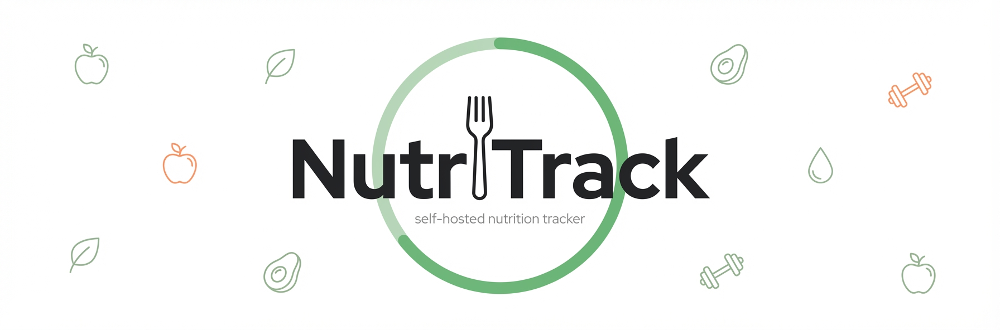
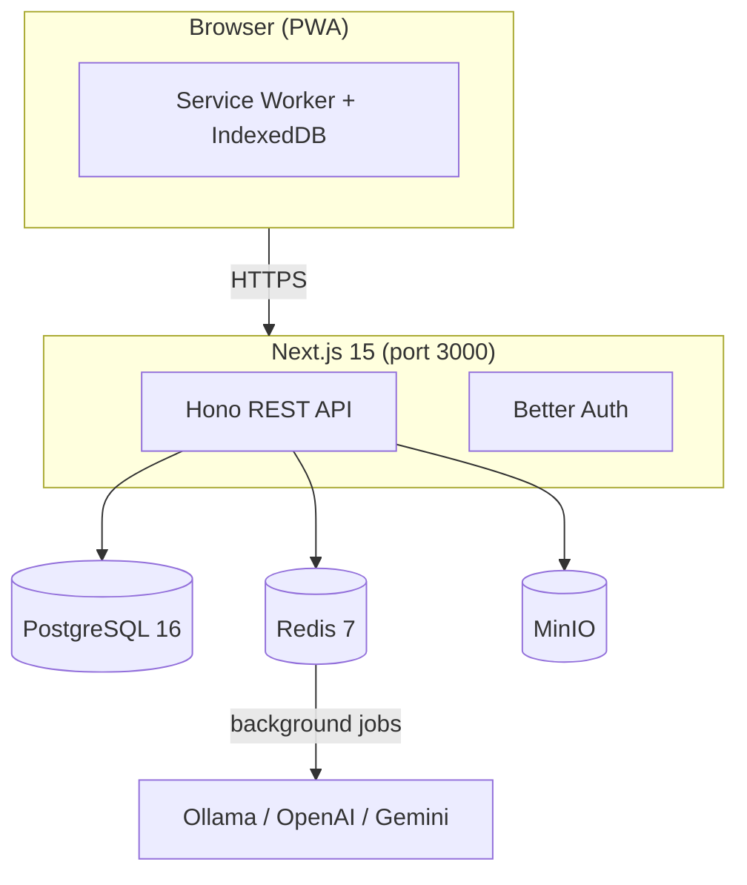
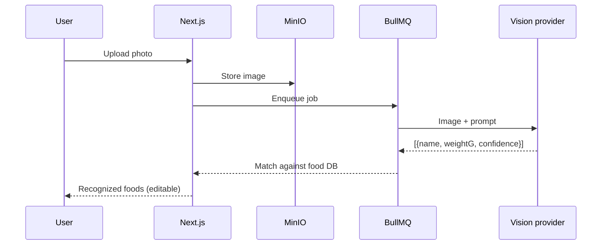

<p align="center">
  
</p>

A free, open-source nutrition tracker you host yourself. Track calories, macros, hydration, weight, and activity — no subscriptions, no cloud, no data harvesting.

Built as an alternative to [Foodvisor](https://www.foodvisor.io/). Docker Compose, one command, done.

---

## What it does

- Snap a photo of your meal, AI identifies the food and estimates weights (Ollama, OpenAI, or Gemini)
- Scan barcodes via Open Food Facts
- Search 10k+ foods (USDA + Open Food Facts), log manually, or use voice input
- Track calories, macros, hydration, weight, and exercise per day
- Get personalized targets based on your profile (TDEE / Mifflin-St Jeor)
- Browse recipes and educational content
- View trends and analytics over time (7d to 1y)
- Works offline as a PWA, syncs when back online
- Guest mode — no signup required, upgrade later

---

## Architecture



---

## Photo recognition flow



---

## Getting started

```bash
git clone https://github.com/sderosiaux/nutritrack.git
cd nutritrack

cp .env.example .env
# Set BETTER_AUTH_SECRET (openssl rand -base64 32)

docker compose up -d
docker compose exec app pnpm db:migrate
docker compose exec app pnpm db:seed   # optional: ~10k foods + demo user
```

App runs at http://localhost:3000. MinIO console at http://localhost:9001.

For production deployment with nginx and SSL, see [docs/self-hosting.md](docs/self-hosting.md).

---

## Configuration

All env vars are documented in `.env.example`. The required ones:

| Variable | What it does |
|---|---|
| `DATABASE_URL` | PostgreSQL connection |
| `REDIS_URL` | Redis connection |
| `BETTER_AUTH_SECRET` | Auth token secret (32+ chars) |
| `MINIO_*` | Object storage for photos |

Optional: `VISION_PROVIDER` (`ollama`/`openai`/`gemini`), SMTP settings for emails, VAPID keys for push notifications, `USDA_API_KEY` for extended food data.

---

## API

OpenAPI 3.0 spec at `/api/v1/openapi.json`. Auth via Better Auth at `/api/auth/*`. All data endpoints under `/api/v1/*` (foods, logs, analytics, profile, recipes, lessons).

---

## Stack

Next.js 15, Hono, PostgreSQL 16 (Drizzle), Redis 7 (BullMQ), MinIO, Better Auth, Tailwind CSS v4, shadcn/ui, Zustand, TanStack Query, Dexie.js, Vitest, Playwright

---

## Contributing

See [CONTRIBUTING.md](CONTRIBUTING.md).

## License

MIT

## Acknowledgments

Inspired by [Foodvisor](https://www.foodvisor.io/). Data from [Open Food Facts](https://world.openfoodfacts.org/) (CC BY-SA) and [USDA FoodData Central](https://fdc.nal.usda.gov/) (public domain).
